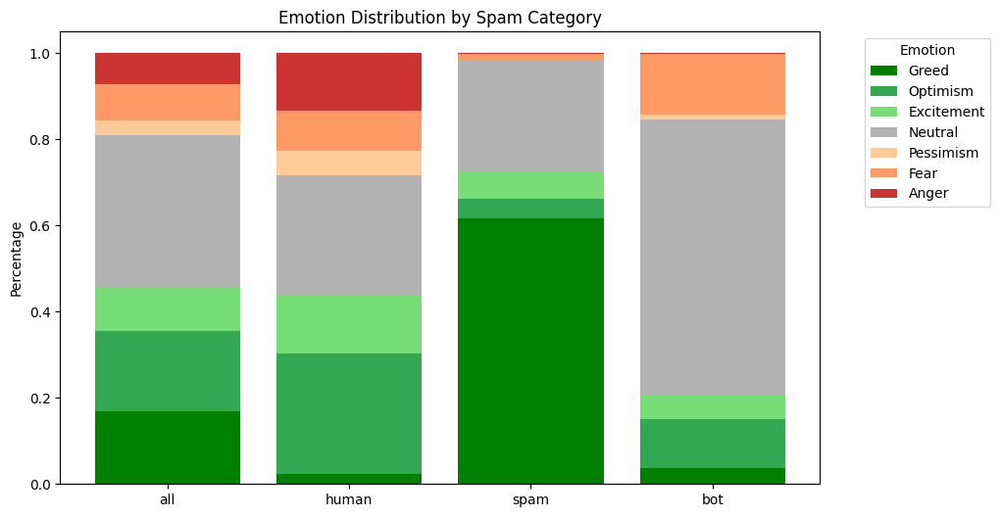

# Zero-Shot Classification

This project provides a generic implementation of a zero-shot text classification system. It is designed to be adaptable to different domains and types of data, allowing classification of texts into user-defined categories without the need for supervised training on specific classes.

This comes from a personal project that I'm extrapolating as a **fast and cheap Zero-shot classification alternative**.

In this case I'm classifying raw scraped tweets on three cathegories, emotion, spam detection and sentiment analyisis.



This allowed for a classification in 3 different topics for 300k tweets with emojis and special characters for **less than 2$**.

The only problem that I ran through (and what I aim to fix in this repo) is the Chinese cap on some topics. For example in this case, all tweets that had the words "Taiwan" or "Xi Jinping" in them gave an error.

This repo is still under construction as it's a side project and I will be finishing it when I have more time.
It was also the first project where I use Github as something more than somewhere to post my projects so the commits may be a bit weird.

## Installation

To set up the environment and run the project, clone the repository and install the required packages:

```bash
git clone https://github.com/sandiumenge/deepseek-zero-shot-classification.git
cd deepseek-zero-shot-classification
pip install -r requirements.txt
```

## Usage

1. **Data Preparation:** Place your text files in the `data/raw` folder. Use functions in `src/data_processing.py` to clean and prepare the data.

2. **Zero-Shot Classification:** Use the `src/classifier.py` module to perform zero-shot classification on your texts, defining the labels or categories you want to classify.

3. **Exploration and Experimentation:** Utilize the notebooks in the `notebooks/` folder to explore the functionality and test the classifier with different datasets and scenarios.

---
